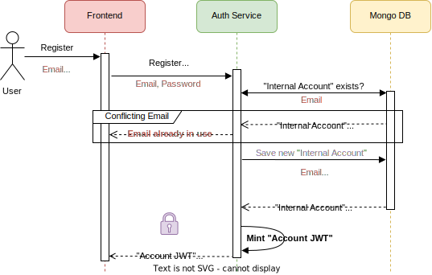
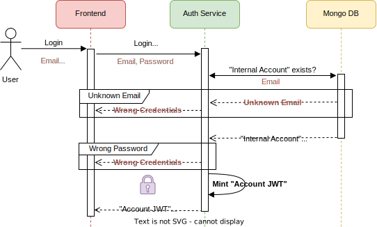
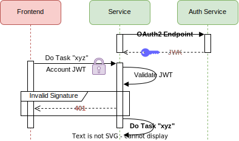
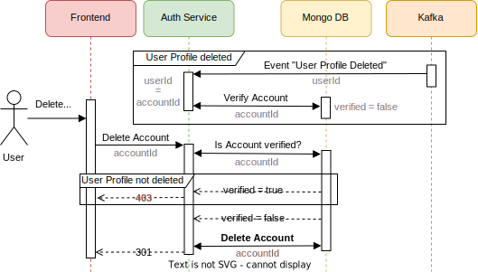

# Auth Service

- Implements external and internal authentication and authorization across the application using JWT
- Orchestrates distribution of JWK to services. Allows validation of JWT issued and signed by the Auth Service
- Manages persisting account and client data.
- Synchronizes accounts with user profiles by processing asynchronous User Service events.

## Noteworthy Use Cases

<details xmlns="http://www.w3.org/1999/html">

<summary><b>Issuing "Account JWT"</b> - Authenticates external frontend-to-service communication</summary>

- Issuing "Account JWT" through registration and/or login via OIDC (Default OIDC provider: Google)\
   


- Issuing "Account JWT" through registration via Basic Auth (Email, Password):\
  


- Issuing "Account JWT" through login via Basic Auth (Email, Password):\
  


- Using "Account JWT" for authenticating external frontend-to-service communication\
  

</details>


<details>
<summary><b>Issuing "Client JWT"</b> - Authenticates and authorizes internal service-to-service communication</summary>

- Issuing "Client JWT" through OAuth2 client credentials grant type. Client authorization is implemented though JWT scopes.\
  


- Using "Client JWT" for authenticating and authorizing internal Service-to-Service communication\
  

</details>

<details xmlns="http://www.w3.org/1999/html">

<summary><b>Account Validation</b> - Asynchronous & unidirectional coupling between accounts and user profiles</summary>

The User Service mandates an asynchronous coupling between <b>one</b> user profile and <b>one</b> account based on two constraints:
<pre>
1) UserId == AccountId
2) User Profile Email != Account Email
</pre>
This loose coupling is unidirectional, with the User Service acting as the ordering party for the Auth Service.


- Account is validated on received event for created user profile sent by User Service. \
  This information is stored in all subsequent issued "Account JWT". (see use cases above)\


- Account can only be deleted if user profile does not exist:\


</details>


## Technology Stack
- Language: Java (developed with JDK 21) 
- Build Orchestration: Gradle 8.4 
- [Featured Dependencies](../authservice/build.gradle): 
  - Spring OAuth2 AuthServer (includes OAuth2 Resource Server & Client) 
  - Spring Kafka Listener
  - Spring MongoDB
  - Java JWT
  - Mockito, Spring EmbeddedKafka and Flapdoodle embedded Mongodb for integration & slice tests 


## Microservice Architecture

The microservice follows a scalable design principle, employing a "Hexagonal Architecture" for enhanced modularity.
This approach facilitates efficient scaling of accounts, clients and services while promoting code clarity and maintainability.

The "Hexagonal Architecture" was implemented according to the guidelines of the accompanying lecture [[1]](https://online-lectures-cs.thi.de/sesa-ws2021-inf/#/6).
These are based on the "Ports and Adapters" pattern by Alistair Cockburn [[2]](https://alistair.cockburn.us/hexagonal-architecture/) and were simplified in a Miro board of the lecture [[3]](https://miro.com/app/board/o9J_llo8IL8=/?moveToWidget=3458764538112404057&cot=14):

<blockquote>

<cite><b>"The rule to obey is that code pertaining to the 'inside' part should not leak into the 'outside' part."</b> <a href="https://alistair.cockburn.us/hexagonal-architecture/">[2]</a></cite>
<details>
<summary>Implemented with ...</summary>

- Hexagonal layers are implemented as Gradle subprojects: `adapters:in`, `domain`, `application`, `adapters:out`.
- Inner Gradle subprojects do not receive any `dependency` from outer subprojects.
</details>
</blockquote>

<blockquote>

<cite><b>No access among the adapters</b> <a href="https://miro.com/app/board/o9J_llo8IL8=/?moveToWidget=3458764538112404057&cot=14">[3]</a></cite>
<details>
<summary>Implemented with ...</summary>

- Input and output adapters separated by Java modules and Gradle projects `adapters:in` and `adapters:out`.
- Java class visibility reduced to package level whenever possible.
</details>
</blockquote>

<blockquote>
<cite><b>"[…] use cases should generally be written at [...] the inner hexagon, to specify the functions [...]"</b> <a href="https://alistair.cockburn.us/hexagonal-architecture/">[1]</a></cite>

<cite><b>Limit input adapter access to domain layer interfaces</b> <a href="https://miro.com/app/board/o9J_llo8IL8=/?moveToWidget=3458764538112404057&cot=14">[3]</a></cite>

<details>
<summary>Implemented with ...</summary>

- The Input Adapter Gradle Subproject does not get access to the subproject of the Application Layer.
</details>
</blockquote>

<blockquote>

<cite><b>"The [domain] logic is implemented without relation to [...] technology"</b><a href="https://miro.com/app/board/o9J_llo8IL8=/?moveToWidget=3458764538112404057&cot=14">[2]</a></cite>

<p style="margin-left: 10px">Implemented by design.</p>
</blockquote>

***Note:*** Increase webpage size for better readability of the vector graphic below


### Comments on Design Decisions

<details>
<summary><b>Input Adapters</b></summary>

- HTTP:
  - Endpoint Controller:
    - Account and Client Management use cases are performed through HTTP calls on `AccountHttpControllerImpl` and `ClientHttpControllerImpl`
    - [Auth Service HTTP endpoints are defined with OpenApi](../authservice/adapters/src/main/resources/openapi-as-rest-spec.yaml)
    - Received DTOs generated by OpenApi are mapped to the domain model 
  - Endpoint Security:
      - Issuing of "Client JWT" is implemented using Spring OAuth2 Authorization Server. The JWK keypair is configured in the `application.yaml` file.
      - Validating OIDC ID-Tokens is implemented using OAuth2 Ressource Server through Spring Security's `JwtIssuerAuthenticationManagerResolver` which queries JWK of the configured OIDC Provider set in the `OIDC_PROVIDER_DISCOVERY_ENDPOINT` environment variable in the `application.yaml` file. By default, the application is registered at the Google Cloud API.
      - Validation email and password in case of login with internal account is performed in Spring Security's `BasicAuthenticationFilterChain`.
- Kafka:
  - Asynchronous, unidirectional communication with the User Service is implemented through Spring's `KafkaListener`.
  - [User Service Events are defined with OpenApi](../authservice/adapters/src/main/resources/openapi-us-event-spec.yaml)
</details>

<details>
  <summary><b>Domain Model</b></summary> 

  - Domain models `Account`, `Client` and `AccessToken` designed using DDD principles 
  - Accounts are implemented through inheritance: OIDCAccount and InternalAccount inherit from Account base class.
  - The issued bearer token is technologically independent. 

</details>


<details>
  <summary><b>Output Adapters</b></summary>

  - Token Provider: JWT
     - Minting JWT Bearer Token for accounts (`subject-type: account`) or clients (`subject-type: client`)
     - The current implementation is limited to RSA. The RSA key pair is set in the environment variables `JWT_PUBLIC_KEY_BASE64` and `JWT_PRIVATE_KEY_BASE64` in the `application.yaml` file.
  - Password Provider: Passay and BCrypt
    - Validation of given passwords regarding hard coded security constraints
    - Generating new passwords with Passay and encoding them with BCrypt.

  - Repositories: MongoDB
    - Repository ports implemented through Spring's Mongo DB module. The URL for the remote database is set in the `AUTH_SERVICE_MONGODB_URI` environment variable.
    - Mapping from the domain model to persisting entities is done through DAOs.
    - <b>Note on account MongoDB adapter: </b> the implementation is a compromise between...
      1) ... simplicity of MongoDB queries with the Spring MongoRepository interface,
      2) ... supplementing the MongoRepository with MongoTemplate for complex queries,
      3) ... and persisting the account inheritance from the domain model.

      [(for details, refer to this discussion)](https://stackoverflow.com/a/50186472 )
</details>

## Microservice Build and Test
- Workdir: `cnd-joboffers/authservice/`
- Build `.jar` with gradle wrapper: (will download gradle 8.4)
  ```
  ./gradlew bootJar
  ```
- Optionally: Execute slice tests with selected autowired components to verify core functionality 
  ```
  ./gradlew test
  ```
- Optionally: Execute end-to-end integration tests to verify use cases
  ```
  ./gradlew integrationTest
  ```
For further details and information on the execution of the microservice, please follow the steps of the [respective execution environment](../README.md#run-this-application-).

## Environment Variables for Configuration
```  
AUTH_SERVICE_PORT = {Spring will start the auth service HTTP server on this port}
AUTH_SERVICE_MONGODB_URI = {URI of remote MongoDB database for account and client data}

KAFKA_BOOTSTRAP_SERVER = {URL of kafka message broker}

INTERNAL_JWT_ISSUER_URL = {FQDN of the Auth Service set in "iss" JWT claim}
OIDC_PROVIDER_DISCOVERY_ENDPOINT = {Discovery endpoint of the external OIDC provider, default = Google}
JWT_PUBLIC_KEY_BASE64 = {Base64 encoded public RSA key for signing JWT}
JWT_PRIVATE_KEY_BASE64 = {Base64 encoded private RSA key for signing JWT}
JWT_KEY_ID = {UUID of JWK pair which will be set in JWT header}
JWT_VALIDITY_IN_SECONDS = {validity in seconds of issued JWT}
JWT_SIGNING_ALGORITHM = {RSA abbreviation according Spring OAuth2 Enum 'SignatureAlgorithm': 'RSA256' (recommended), 'RS384' or 'RS512'. Will be set in "alg" claim of JWT}
```