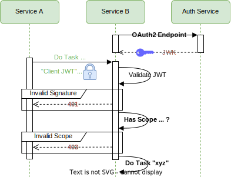
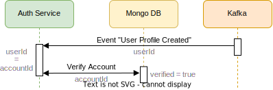

# Auth Service

- Implements external and internal authentication and authorization across the application using JWT
- Orchestrates distribution of JWK to services. Allows validation of JWT issued and signed by the Auth Service
- Manages persisting account and client data.
- Synchronizes accounts with user profiles by processing asynchronous User Service events.

## Noteworthy Use Cases

<details xmlns="http://www.w3.org/1999/html">

<summary><b>Issuing "Account JWT"</b> - Authenticates external frontend-to-service communication</summary>

- Issuing "Account JWT" through registration and/or login via OIDC (Default OIDC provider: Google)\
   


- Issuing "Account JWT" through registration via Basic Auth (Email, Password):\
  


- Issuing "Account JWT" through login via Basic Auth (Email, Password):\
  


- Using "Account JWT" for authenticating external frontend-to-service communication\
  

</details>


<details>
<summary><b>Issuing "Client JWT"</b> - Authenticates and authorizes internal service-to-service communication</summary>

- Issuing "Client JWT" through OAuth2 client credentials grant type. Client authorization is implemented though JWT scopes.\
  


- Using "Client JWT" for authenticating and authorizing internal Service-to-Service communication\
  

</details>

<details xmlns="http://www.w3.org/1999/html">

<summary><b>Account Validation</b> - Asynchronous & unidirectional coupling between accounts and user profiles</summary>

The User Service mandates an asynchronous coupling between <b>one</b> user profile and <b>one</b> account based on two constraints:
<pre>
1) UserId == AccountId
2) User Profile Email != Account Email
</pre>
This loose coupling is unidirectional, with the User Service acting as the ordering party for the Auth Service.


- Account is validated on received event for created user profile sent by User Service. \
  This information is stored in all subsequent issued "Account JWT". (see use cases above)\


- Account can only be deleted if user profile does not exist:\


</details>


## Technology Stack
- Language: Java (developed with JDK 21) 
- Build Orchestration: Gradle 8.4 
- [Featured Dependencies](../authservice/build.gradle): 
  - Spring OAuth2 AuthServer (includes OAuth2 Resource Server & Client) 
  - Spring Kafka Listener
  - Spring MongoDB
  - Java JWT
  - Mockito (Unit & Component tests) 


## Microservice Architecture

The microservice follows a scalable design principle, employing a hexagonal architecture for enhanced modularity.
This approach facilitates efficient scaling of accounts, clients and services while promoting code clarity and maintainability.

TODO: an manchen stellen prinzipien verletzt (Spring geschuldet)

Package naming and organization were adopted from the [provided lecture example](), ensuring alignment with the given requirements. 

***Note:*** Increase webpage size for better readability of the vector graphic below


### Comments on Design Decisions

<details>
<summary><b>Input Adapters</b></summary>

- Security: 
  - <b>Note: </b>Spring Security's authentication and authorization architecture requires calling the output ports directly, bypassing the Domain layer.
  - Issuing of "Client JWT" is implemented using Spring OAuth2 Authorization Server
  - Validating OIDC ID-Tokens is implemented using OAuth2 Ressource Server which queries JWK of the configured OIDC Provider set in the `OIDC_PROVIDER_DISCOVERY_ENDPOINT` environment variable using Spring Security's `JwtIssuerAuthenticationManagerResolver`. By default, the application is registered at the Google Cloud API.   
  - Validation email and password in case of login with internal account is performed in Spring Security's `BasicAuthenticationFilterChain`.
- HTTP:
  - Account and Client Management use cases are performed through HTTP calls on `AccountHttpControllerImpl` and `ClientHttpControllerImpl`
  - [Auth Service HTTP endpoints are defined with OpenApi](../authservice/adapters/src/main/resources/openapi-as-rest-spec.yaml)
  - Received DTOs generated by OpenApi are mapped to the domain model 

- Kafka:
  - Asynchronous, unidirectional communication with the User Service is implemented through Spring's `KafkaListener`.
  - [User Service Events are defined with OpenApi](../authservice/adapters/src/main/resources/openapi-us-event-spec.yaml)
</details>

<details>
  <summary><b>Domain and Model</b></summary>

  - Account and Client Service: 
    - Interfaces reflecting use cases  
  - JWT: 
    - JWK publication for other services. The current implementation is limited to RSA. The RSA key pair is set in the environment variables `JWT_PUBLIC_KEY_BASE64` and `JWT_PRIVATE_KEY_BASE64`
    - Minting new "Account JWT" or "Client JWT" 
  - Password: 
    - Validation of given passwords regarding hard coded security constraints
    - Encoding and generating new passwords
  - Model: 
    - Domain model designed using DDD principles 
    - Accounts are implemented through inheritance: OIDCAccount and InternalAccount inherit from Account base class.
</details>

<details>
  <summary><b>Output Ports</b></summary>

  - Repository:
    - Interfaces for persisting account and client data
</details>

<details>
  <summary><b>Output Adapters</b></summary>
  
  - MongoDB:
    - Repository ports implemented through Spring's Mongo DB module. The URL for the remote database is set in the `AUTH_SERVICE_MONGODB_URI` environment variable.
    - Mapping from the domain model to persisting entities is done through DAOs.
    - <b>Note on account MongoDB adapter: </b> the implementation is a compromise between...
      1) ... simplicity of MongoDB queries with the Spring MongoRepository interface,
      2) ... supplementing the MongoRepository with MongoTemplate for complex queries,
      3) ... and persisting the account inheritance from the domain model.

      [(for details, refer to this discussion)](https://stackoverflow.com/a/50186472 )
</details>


## Environment Variables for Configuration
```  
AUTH_SERVICE_PORT = {Spring will start the auth service HTTP server on this port}
AUTH_SERVICE_MONGODB_URI = {URI of remote MongoDB database for account and client data}

KAFKA_BOOTSTRAP_SERVER = {URL of kafka message broker}

INTERNAL_JWT_ISSUER_URL = {FQDN of the Auth Service set in "iss" JWT claim}
OIDC_PROVIDER_DISCOVERY_ENDPOINT = {Discovery endpoint of the external OIDC provider, default = Google}
JWT_PUBLIC_KEY_BASE64 = {Base64 encoded public RSA key for signing JWT}
JWT_PRIVATE_KEY_BASE64 = {Base64 encoded private RSA key for signing JWT}
JWT_KEY_ID = {UUID of JWK pair which will be set in JWT header}
JWT_VALIDITY_IN_SECONDS = {validity in seconds of issued JWT}
JWT_SIGNING_ALGORITHM = {RSA abbreviation according Spring OAuth2 Enum 'SignatureAlgorithm': 'RSA256' (recommended), 'RS384' or 'RS512'. Will be set in "alg" claim of JWT}
```