# Career Service:

- Allows the creation of job offers and job applications for these job offers. This is the main business logic.
- Communicates with the user service for validation and applying changes to users and companies to their job offers/applications
- Is a CQRS + Event-Driven application.

## Noteworthy Use Cases

<details xmlns="http://www.w3.org/1999/html">

<summary><b>Full Basic User Story</b></summary>

1. Create Job Offer by company member, this will be mirrored to query side
2. User reads Job Offer and applies for it, creating a Job Application
3. Company member reads Job Application and accepts the application
4. Company member closes Job Offer and deletes it afterward. 
   - Internally the application will mark the Job Offer stream as deleted in the Event Store
   - This deletes the Job Offer from the Query Repository, but also results in the deletion of all associated Job Applications
   - The Job Applications are marked as deleted in the Event Store and removed from the Query Repository


</details>

<details xmlns="http://www.w3.org/1999/html">

<summary><b>Inter-Service Communication Example</b></summary>

1. Company gets deleted in the user-service, which sends an event to the kafka event bus
2. This event is received and every job offer with this company is fetched from the database
3. The found job offers are deleted via a JobOffer-Deletion internal event
4. This triggers the normal workflow of deleting the corresponding view and deleting all job applications of this job offer



</details>

## Technology Stack
- Language: Java (developed with JDK 21)
- Build Orchestration: Gradle 8.4
- MongoDB as View Database
- EventStoreDB as Event Database and internal Event Bus
- Kafka Event Bus for external events
- Testcontainers / Wiremock for integration tests

## Microservice Architecture

***Note:*** Increase webpage size for better readability of the vector graphic below

<details xmlns="http://www.w3.org/1999/html">

<summary><b>Grafik</b></summary>



</details>

### Comments on Design decisions

- There are three types of input adapters:
  - HTTP Query/Command ApiAdapter: Receives http requests from the frontend and returns corresponding answers
  - Internal Event Listener: Listens to internal events (EventStoreDB) like JobOffer-Created / Modified / Deleted.
    - Command: Upon receiving an event, the write side is affected, e.g. JobOffer-Deleted -> JobApplication-Deleted
    - Query: Upon receiving an event, the read side is affected (Projector), e.g. JobOffer-Created -> Save JobOfferView in MongoDB
  - External Event Listener: Listens to external events (Kafka) coming from other microservice, e.g. User-Deleted -> JobApplication-Deleted
- Comments to concurrency/eventual-consistency problems:
  - Example: 
    1. Company is deleted
    2. Fetch all Job Offers for that company
    3. Deleted every Job Offer of company. 
    - BUT, if between 2. and 3. a Job Offer is created, this job offer will not be deleted
  - From business view this is not a significant problem, because:
    - A stale job offer will be deleted eventually by the database (TTL of entry)
    - A stale job application will be deleted once the job offer is deleted or by TTL
  - Therefore (and also for simplicity's sake), there are no mechanism to fix inconsistencies

## Required Env Vars:

```  
CAREER_SERVICE_PORT = {Spring will start the web server on this port}
CAREER_SERVICE_MONGODB_URI = {URI of MongoDB Document for career service data}

KAFKA_BOOTSTRAP_SERVER = {URL of kafka message broker}
INTERNAL_JWT_ISSUER_URL = {Issuer URL of valid internal JWTs, this is the auth-service}
EVENT_STORE_URI = {event-store-db-uri}

CAREER_SERVICE_CLIENT_ID = {The client id to be authenticated against auth-service, used for internal service to service calls}
CAREER_SERVICE_CLIENT_SECRET = {The client secret to be authenticated against auth-service, used for internal service to service calls}

USER_SERVICE_URL = {user service http endpoint}
```
