# Notification Service:

- Receives events from the user service over kafka and outputs them to the console
- This can be used to send for example emails to customers
- Note: This service is very small, due to the higher complexity of the career service

## Microservice Architecture

***Note:*** Increase webpage size for better readability of the vector graphic below

<details xmlns="http://www.w3.org/1999/html">

<summary><b>Grafik</b></summary>


</details>


## Required Env Vars:

```  
KAFKA_BOOTSTRAP_SERVER = {URL of kafka message broker}
```
