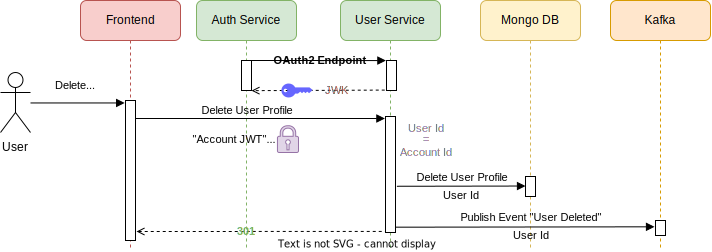

# User Service:

- Responsible for lifecycle of user profiles and companies
- Manages persisting user and company data.
- Ensures consistency between users and companies as well as between users and accounts.


## Noteworthy Use Cases

<details xmlns="http://www.w3.org/1999/html">

<summary><b>Consistent states between users and companies</b> - Atomic transactions</summary>

- If invited, a user can be member of none, one or more companies.\
    


- On company deletion by the owner, all member relations are dissolved. \
    

</details>


<details xmlns="http://www.w3.org/1999/html">

<summary><b>Consistent states between users and accounts</b> - Publishing asynchronous events</summary>

The User Service mandates an asynchronous coupling between <b>one</b> user profile and <b>one</b> account based on two constraints:
<pre>
1) UserId == AccountId
2) User Profile Email != Account Email
</pre> 

- After creating a user profile, a published event will [create a link to an account](./auth-service.md). \
    


- When a user profile is deleted, the coupling with an account is [dissolved by a published event](./auth-service.md). \
  
  
</details>


## Technology Stack
- Language: Java (developed with JDK 21)
- Build Orchestration: Gradle 8.4
- [Featured Dependencies](../userservice/build.gradle):
  - Spring OAuth2 Resource Server 
  - Spring Kafka Template
  - Spring MongoDB
  - Mockito (Unit & Component tests)

## Microservice Architecture

The microservice follows a scalable design principle, employing a hexagonal architecture for enhanced modularity.
This approach facilitates efficient users and companies while promoting code clarity and maintainability.

Package naming and organization were adopted from the [provided lecture example](), ensuring alignment with the given requirements.

***Note:*** Increase webpage size for better readability of the vector graphic below


(Increase webpage size for better readability of vector graphic)

### Comments on Design decisions

<details>
  <summary><b>Input Adapters</b></summary>
  
  - Security: 
    - With Spring's `OAuth2 Resource Server`, selected endpoints are authenticated by validating "Account JWT" or "Client JWT" using the JWK of the Auth Service   
    - Spring Security `Authorization Managers` allow authorizing endpoint access.
  - HTTP:
      - User and Company Management use cases are performed through HTTP calls on `UserHttpControllerImpl` and `CompanyHttpControllerImpl`
      - Received DTOs are mapped to the domain model
      - [User Service HTTP endpoints are defined with OpenApi](../userservice/adapters/src/main/resources/openapi-us-rest-spec.yaml)
</details>

<details>
  <summary><b>Domain and Model</b></summary>

  - Company and User Service: 
    - Interfaces reflecting use cases
  - Model: 
    - Domain model designed using DDD principles.
    - This design was chosen to ensure atomic transactions between users and companies.
</details>

<details>
  <summary><b>Output Ports</b></summary>

  - Repository:
    - Interfaces for persisting account and client data
  - Events:
    - Distributing user and company data asynchronously to other services.
</details>

<details>
  <summary><b>Output Adapters</b></summary>

- MongoDB:
  - Repository ports implemented through Spring's `MongoRepository` module. The URL for the remote database is set in the `AUTH_SERVICE_MONGODB_URI` environment variable.
  - Mapping from the domain model to persisting entities is done through DAOs
- Kafka: 
  - Event Ports are implemented using Spring's `KafkaTemplates`
  - [User Service Events are defined with OpenApi](../userservice/adapters/src/main/resources/openapi-us-event-spec.yaml)
  - Mapping from the domain model to persisting entities is done through generated OpenApi classes.

</details>


## Environment Variables for Configuration

```  
AUTH_SERVICE_PORT = {Spring will start the User Service HTTP server on this port}
AUTH_SERVICE_MONGODB_URI = {URI of remote MongoDB database for user and company data}

KAFKA_BOOTSTRAP_SERVER = {URL of kafka message broker}

INTERNAL_JWT_ISSUER_URL = {FQDN of the Auth Service set in "iss" JWT claim}
```