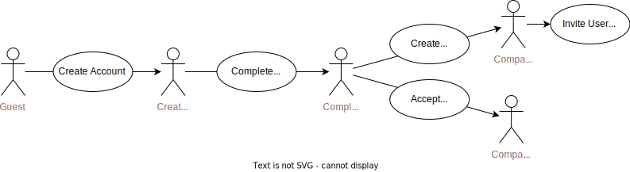

# Cloud-native development (CND) Project: "Joboffers"

This CND project is a small application that allows users to apply to job offers.
Respectively, users can also create companies and post job offers in their name.
We use microservices written in Java with Spring Boot and a hexagonal architecture.
Our services include:
- Auth Service (Authentication) by Carl
- User Service (User Management) by Carl
- Career Service (Main Business Logic) by Simon
- Notification Service (Logs events to console to demonstrate a possible use case) by Simon

<b>Fulfillment of requirements</b>

- [x] Das Anwendungsbeispiel muss je Team-Mitglied mindestens aus zwei Diensten bestehen und Daten erfassen, ein Dienst sollte Anfragen über HTTP entgegen nehmen.
  - We have four microservices, which all store their data in a database and are connected over http (except notification service) and events
- [x] Realisieren Sie je Team-Mitglied mindestens einen Dienst unter Verwendung eines modernen Architekturansatzes.
  - All our services use a hexagonal architecture
- [x] Ergänzen Sie ein kleines Frontend, welches die realisierte Backend-Funktionalität nutzt.
  - We created a frontend in react to use our application in a "real world" scenario
- [x] Ergänzen Sie für die Dienste einfache Unit-Tests, die den jeweiligen Dienst überprüfen, eine vollständige Test-Abdeckung ist nicht notwendig.
  - We created some unit test cases
- [x] Dokumentieren Sie kurz, was nötig ist, um die Dienste in einer VM zu installieren und zu starten.
  - Documented below
- [x] Erstellen Sie Dockerfiles, welches je einen Dienst zur Ausführung bringt und Dokumentieren Sie, wie diese Dienste installiert und gestartet werden.
  - Documented below
- [x] Erstellen Sie ein Docker-Compose-File, welche alle Dienste konfiguriert und Dokumentieren Sie, wie diese Datei genutzt wird, ergänzen Sie einen Load-Balancer (z.B. nginx) um Anfragen zu verteilen. Achten Sie auf die Konfiguration Ihrer Volumes.
  - Documented below
- [x] Erstellen Sie Kubernetes-Manifeste, welche Ihre Dienste konfiguriert.
  - Documented below
- [x] Automatisieren Sie den Bauprozess (die Bereitstellung ist nicht zwingend erforderlich) in einer wählbaren Umgebung, verwenden Sie hierfür z.B. das GitLab und verfügbare GitLab-CI.
  - We use Github Actions to build our applications, see `.github/workflows`
- [x] Skizzieren Sie die realisierte finale Service-Architektur und die innere Architektur eines Dienstes.
  - See `.documentation` folder

## Application Use Cases

What does this application do from a user perspective? only use-case level no technical details:

Actor role evolution:

- Actor: Non-Registered User (Guest):
  - List Job offers etc. ...
  - Can create Account with OIDC or Basic Auth.
- Actor: Registered + Authenticated Account (No Profile):
  - ... TODO: Was haben wir hier nochmal gesagt?
  - Must complete user profile for use cases x y and z
- Actor: Registered + Authenticated User (Account + User Profile):
  - Verified User = Account + User Profile
  - Can perform core use cases a b and c ...
- Actor: Company Owner
  - Update company details and delete company
- Actor: Company Member
  - Can create, edit, delete job offers in the name of the company

## Run this application ...
- ... [locally 'bare metal' (un-containerized)](.documentation/bare-metal.md)
- ... [locally as seperated docker containers](.documentation/docker-seperated.md)
- ... [locally using docker compose](.documentation/docker-compose.md)
- ... [on a kubernetes cluster](.documentation/kubernetes-helm.md)

## System architecture

<b>Frontend</b> (<a href=".documentation/frontend.md">detailed documentation</a>)
  

  
  - Uses the provided REST Api of the services to implement the use cases in a GUI
  - Handles OIDC Authentication 

  
<b>Auth Service</b> (<a href=".documentation/auth-service.md">detailed documentation</a>)

  
  - Implements external and internal authentication and authorization across the application using JWT
  - Synchronizes accounts with user profiles by processing asynchronous User Service events.

  
<b>User Service</b> (<a href=".documentation/user-service.md">detailed documentation</a>)

  
  - Responsible for consistent lifecycle of user profiles and companies.
  - Ensures consistency between accounts and user profiles and account by acting as an asynchronous ordering party for the Auth Service.

  
<b>Career Service</b> (<a href=".documentation/career-service.md">detailed documentation</a>)

   
  - Contains main business logic to create, edit and delete job offers / job applications
  - Has integration with the user-service over REST Api and Kafka events
  - Uses CQRS and Event-sourcing

  
<b>Notification Service</b> (<a href=".documentation/notification-service.md">detailed documentation</a>)

  - Small microservice that listens to events sent to the kafka event bus and prints information out to the console

## Featured technology  stack

- Frontend Implementation: React
- Service Implementation: Spring Boot
- Authentication: OIDC, OAuth2 and JWT
- Communication: (unsecured) HTTP & Kafka + OpenAPI
- Persistence: 
  - Event Sourcing
  - MongoDB

