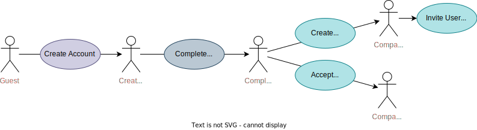

# Cloud-native development (CND) Project: "Joboffers"

Very brief overview of project context (Student project) and structure of this readme ...
- Microservice application for student project for CND subject ... smth like this
- [Fulfillment of requirements (German)]()

## Application Use Cases

In each microservice, the respective use cases are verified by end-to-end integration tests.
The core functionality of each service is either verified by fully mocked unit tests or slice tests with selected autowired components.

Actor role evolution:

## Run this application ...
- ... [locally 'bare metal' (un-containerized)](.documentation/bare-metal.md)
- ... [locally as seperated docker containers](.documentation/docker-seperated.md)
- ... [locally using docker compose](.documentation/docker-compose.md)
- ... [on a kubernetes cluster](.documentation/kubernetes-helm.md)

## System architecture

<b>Frontend</b> (<a href=".documentation/frontend.md">detailed documentation</a>)
  

  
  - TODO: Converts Use Cases to Microservice Calls + Handles OIDC Authentication

  
<b>Auth Service</b> (<a href=".documentation/auth-service.md">detailed documentation</a>)

  
  - Implements external and internal authentication and authorization across the application using JWT
  - Synchronizes accounts with user profiles by processing asynchronous User Service events.

  
<b>User Service</b> (<a href=".documentation/user-service.md">detailed documentation</a>)

  
  - Responsible for consistent lifecycle of user profiles and companies.
  - Ensures consistency between accounts and user profiles and account by acting as an asynchronous ordering party for the Auth Service.

  
<b>Career Service</b> (<a href=".documentation/career-service.md">detailed documentation</a>)

   
    - Logic: Job offer & application Management
      - Calls User Service to do ...     
      - Listens to Events on Kafka ...
    - Persistence: Job Data with Event Sourcing

  
<b>Notification Service</b> (<a href=".documentation/notification-service.md">detailed documentation</a>)

  - Logic: User Profile & Company Management
      - Listens to xyz Events on Kafka and does abc

## Featured technology  stack

TODO...
- Frontend Implementation: React
- Service Implementation: Spring Boot
- Authentication: OIDC, OAuth2 and JWT
- Communication: (unsecured) HTTP & Kafka + OpenAPI
- Persistence: 
  - Event Sourcing
  - MongoDB

